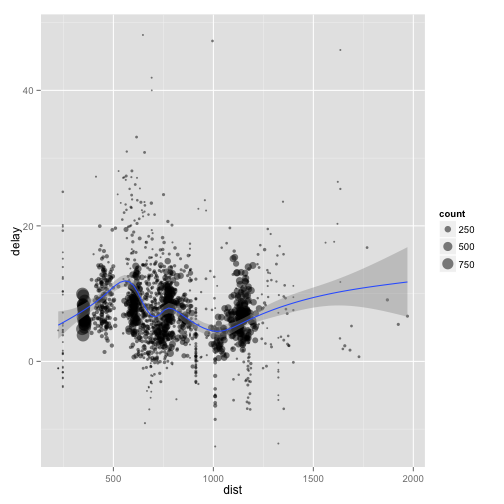

<!--
%\VignetteEngine{knitr}
%\VignetteIndexEntry{Introduction to dplyr}
-->


# Introduction to dplyr

When working with data you must:

* Figure out what you want to do.

* Precisely describe what you want in the form of a computer program.

* Execute the code.

The dplyr package makes each of these steps as fast and easy as possible by:

* Elucidating the most common data manipulation operations, so that your 
  options are helpfully constrained when thinking about how to tackle a 
  problem.
 
* Providing simple functions that correspond to the most common 
  data manipulation verbs, so that you can easily translate your thoughts 
  into code.

* Using efficient data storage backends, so that you spend as little time 
  waiting for the computer as possible.

The goal of this document is to introduce you to the basic tools that dplyr provides, and show how you to apply them to data frames. Other vignettes provide more details on specific topics:

* databases: as well as in memory data frames, dplyr also connects to 
  databases. It allows you to work with remote, out-of-memory data, using
  exactly the same tools, because dplyr will translate your R code into 
  the appropriate SQL.
  
* benchmark-baseball: see how dplyr compares to other tools for data 
  manipulation on a realistic use case.
  
* window-functions: a window function is a variation on an aggregation 
  function, where an aggregate functions `n` inputs to produce 1 output, a
  window function uses `n` inputs to produce `n` outputs.

## Data: hflights

To explore the basic data manipulation verbs of dplyr, we'll start with the built in 
`hflights` data frame. This dataset contains all 227,496 flights that departed from Houston in 2011. The data comes from the US [Bureau of Transporation Statistics](http://www.transtats.bts.gov/DatabaseInfo.asp?DB_ID=120&Link=0), and is documented in `?hflights`


```r
library(hflights)
dim(hflights)
```

```
#> [1] 227496     21
```

```r
head(hflights)
```

```
#>      Year Month DayofMonth DayOfWeek DepTime ArrTime UniqueCarrier
#> 5424 2011     1          1         6    1400    1500            AA
#> 5425 2011     1          2         7    1401    1501            AA
#> 5426 2011     1          3         1    1352    1502            AA
#> 5427 2011     1          4         2    1403    1513            AA
#> 5428 2011     1          5         3    1405    1507            AA
#> 5429 2011     1          6         4    1359    1503            AA
#>      FlightNum TailNum ActualElapsedTime AirTime ArrDelay DepDelay Origin
#> 5424       428  N576AA                60      40      -10        0    IAH
#> 5425       428  N557AA                60      45       -9        1    IAH
#> 5426       428  N541AA                70      48       -8       -8    IAH
#> 5427       428  N403AA                70      39        3        3    IAH
#> 5428       428  N492AA                62      44       -3        5    IAH
#> 5429       428  N262AA                64      45       -7       -1    IAH
#>      Dest Distance TaxiIn TaxiOut Cancelled CancellationCode Diverted
#> 5424  DFW      224      7      13         0                         0
#> 5425  DFW      224      6       9         0                         0
#> 5426  DFW      224      5      17         0                         0
#> 5427  DFW      224      9      22         0                         0
#> 5428  DFW      224      9       9         0                         0
#> 5429  DFW      224      6      13         0                         0
```


dplyr can work with data frames as is, but if you're dealing with large data, it's worthwhile to convert them to a `tbl_df`: this is a wrapper around a data frame that won't accidentally print a lot of data to the screen.


```r
hflights_df <- tbl_df(hflights)
hflights_df
```

```
#> Source: local data frame [227,496 x 21]
#> 
#>      Year Month DayofMonth DayOfWeek DepTime ArrTime UniqueCarrier
#> 5424 2011     1          1         6    1400    1500            AA
#> 5425 2011     1          2         7    1401    1501            AA
#> 5426 2011     1          3         1    1352    1502            AA
#> 5427 2011     1          4         2    1403    1513            AA
#> ..    ...   ...        ...       ...     ...     ...           ...
#> Variables not shown: FlightNum (int), TailNum (chr), ActualElapsedTime
#>   (int), AirTime (int), ArrDelay (int), DepDelay (int), Origin (chr), Dest
#>   (chr), Distance (int), TaxiIn (int), TaxiOut (int), Cancelled (int),
#>   CancellationCode (chr), Diverted (int)
```


## Basic verbs

dplyr provides five basic data manipulation verbs that work on a single table: `filter()`, `arrange()`, `select()`, `mutate()` and `summarise()`. If you've used plyr before, many of these will be familar.

## Filter rows with `filter()`

`filter()` allows you to select a subset of the rows of a data frame. The first argument is the name of the data frame, and the second and subsequent are filtering expressions evaluated in the context of that data frame:

For example, we can select all flights on January 1st with:


```r
filter(hflights_df, Month == 1, DayofMonth == 1)
```

```
#> Source: local data frame [552 x 21]
#> 
#>    Year Month DayofMonth DayOfWeek DepTime ArrTime UniqueCarrier FlightNum
#> 1  2011     1          1         6    1400    1500            AA       428
#> 2  2011     1          1         6     728     840            AA       460
#> 3  2011     1          1         6    1631    1736            AA      1121
#> 4  2011     1          1         6    1756    2112            AA      1294
#> ..  ...   ...        ...       ...     ...     ...           ...       ...
#> Variables not shown: TailNum (chr), ActualElapsedTime (int), AirTime
#>   (int), ArrDelay (int), DepDelay (int), Origin (chr), Dest (chr),
#>   Distance (int), TaxiIn (int), TaxiOut (int), Cancelled (int),
#>   CancellationCode (chr), Diverted (int)
```


This is equivalent to the more verbose:


```r
hflights[hflights$Month == 1 & hflights$DayofMonth == 1, ]
```


`filter()` works similarly to `subset()` except that you can give it any number of filtering conditions which are joined together with `&` (not `&&` which is easy to do accidentally!).  You can use other boolean operators explicitly:


```r
filter(hflights_df, Month == 1 | Month == 2)
```


## Arrange rows with `arrange()`

`arrange()` works similarly to `filter()` except that instead of filtering or selecting rows, it reorders them. It takes a data frame, and a set of column names (or more complicated expressions) to order by. If you provide more than one column name, each additional column will be used to break ties in the valeus of preceeding columns:


```r
arrange(hflights_df, DayofMonth, Month, Year)
```

```
#> Source: local data frame [227,496 x 21]
#> 
#>    Year Month DayofMonth DayOfWeek DepTime ArrTime UniqueCarrier FlightNum
#> 1  2011     1          1         6    1400    1500            AA       428
#> 2  2011     1          1         6     728     840            AA       460
#> 3  2011     1          1         6    1631    1736            AA      1121
#> 4  2011     1          1         6    1756    2112            AA      1294
#> ..  ...   ...        ...       ...     ...     ...           ...       ...
#> Variables not shown: TailNum (chr), ActualElapsedTime (int), AirTime
#>   (int), ArrDelay (int), DepDelay (int), Origin (chr), Dest (chr),
#>   Distance (int), TaxiIn (int), TaxiOut (int), Cancelled (int),
#>   CancellationCode (chr), Diverted (int)
```


Use `desc()` to order a order in descending order:


```r
arrange(hflights_df, desc(ArrDelay))
```

```
#> Source: local data frame [227,496 x 21]
#> 
#>    Year Month DayofMonth DayOfWeek DepTime ArrTime UniqueCarrier FlightNum
#> 1  2011    12         12         1     650     808            AA      1740
#> 2  2011     8          1         1     156     452            CO         1
#> 3  2011    11          8         2     721     948            MQ      3786
#> 4  2011     6         21         2    2334     124            UA       855
#> ..  ...   ...        ...       ...     ...     ...           ...       ...
#> Variables not shown: TailNum (chr), ActualElapsedTime (int), AirTime
#>   (int), ArrDelay (int), DepDelay (int), Origin (chr), Dest (chr),
#>   Distance (int), TaxiIn (int), TaxiOut (int), Cancelled (int),
#>   CancellationCode (chr), Diverted (int)
```


`dplyr::arrange()` works the same way as `plyr::arrange()`. It's a straighforward wrapper around `order()` that requires less typing. The previous code is equivalent to:


```r
hflights[order(hflights$DayofMonth, hflights$Month, hflights$Year), ]
hflights[order(desc(hflights$ArrDelay)), ]
```


## Select columns with `select()`

Often you work with large datasets with many columns where only a few are actually of interest to you. `select()` allows you to rapidly zoom in on a useful subset using operations that usually only work on numeric variable positions:


```r
# Select columns by name
select(hflights_df, Year, Month, DayOfWeek)
```

```
#> Source: local data frame [227,496 x 3]
#> 
#>      Year Month DayOfWeek
#> 5424 2011     1         6
#> 5425 2011     1         7
#> 5426 2011     1         1
#> 5427 2011     1         2
#> ..    ...   ...       ...
```

```r
# Select all columns between Year and DayOfWeek (inclusive)
select(hflights_df, Year:DayOfWeek)
```

```
#> Source: local data frame [227,496 x 4]
#> 
#>      Year Month DayofMonth DayOfWeek
#> 5424 2011     1          1         6
#> 5425 2011     1          2         7
#> 5426 2011     1          3         1
#> 5427 2011     1          4         2
#> ..    ...   ...        ...       ...
```

```r
# Select all columns except Year and DayOfWeek
select(hflights_df, -(Year:DayOfWeek))
```

```
#> Source: local data frame [227,496 x 17]
#> 
#>      DepTime ArrTime UniqueCarrier FlightNum TailNum ActualElapsedTime
#> 5424    1400    1500            AA       428  N576AA                60
#> 5425    1401    1501            AA       428  N557AA                60
#> 5426    1352    1502            AA       428  N541AA                70
#> 5427    1403    1513            AA       428  N403AA                70
#> ..       ...     ...           ...       ...     ...               ...
#> Variables not shown: AirTime (int), ArrDelay (int), DepDelay (int), Origin
#>   (chr), Dest (chr), Distance (int), TaxiIn (int), TaxiOut (int),
#>   Cancelled (int), CancellationCode (chr), Diverted (int)
```


This function works similarly to the `select` argument to the `base::subset()`. It's its own function in dplyr, because the dplyr philosophy is to have small functions that each do one thing well.

## Add new columns with `mutate()`

As well as selecting from the set of existing columns, it's often useful to add new columns that are functions of existing columns.  This is the job of `mutate()`:


```r
mutate(hflights_df, 
  gain = ArrDelay - DepDelay, 
  speed = Distance / AirTime * 60)
```

```
#> Source: local data frame [227,496 x 23]
#> 
#>    Year Month DayofMonth DayOfWeek DepTime ArrTime UniqueCarrier FlightNum
#> 1  2011     1          1         6    1400    1500            AA       428
#> 2  2011     1          2         7    1401    1501            AA       428
#> 3  2011     1          3         1    1352    1502            AA       428
#> 4  2011     1          4         2    1403    1513            AA       428
#> ..  ...   ...        ...       ...     ...     ...           ...       ...
#> Variables not shown: TailNum (chr), ActualElapsedTime (int), AirTime
#>   (int), ArrDelay (int), DepDelay (int), Origin (chr), Dest (chr),
#>   Distance (int), TaxiIn (int), TaxiOut (int), Cancelled (int),
#>   CancellationCode (chr), Diverted (int), gain (int), speed (dbl)
```


`dplyr::mutate()` works the same way as `plyr::mutate()` and similarly to `base::transform()`. The key difference between `mutate()` and `transform()` is that mutate allows you to refer to columns that you just created:


```r
mutate(hflights_df, 
  gain = ArrDelay - DepDelay, 
  gain_per_hour = gain / (AirTime / 60)
)
```

```
#> Source: local data frame [227,496 x 23]
#> 
#>    Year Month DayofMonth DayOfWeek DepTime ArrTime UniqueCarrier FlightNum
#> 1  2011     1          1         6    1400    1500            AA       428
#> 2  2011     1          2         7    1401    1501            AA       428
#> 3  2011     1          3         1    1352    1502            AA       428
#> 4  2011     1          4         2    1403    1513            AA       428
#> ..  ...   ...        ...       ...     ...     ...           ...       ...
#> Variables not shown: TailNum (chr), ActualElapsedTime (int), AirTime
#>   (int), ArrDelay (int), DepDelay (int), Origin (chr), Dest (chr),
#>   Distance (int), TaxiIn (int), TaxiOut (int), Cancelled (int),
#>   CancellationCode (chr), Diverted (int), gain (int), gain_per_hour (dbl)
```


```r
transform(hflights, 
  gain = ArrDelay - DepDelay, 
  gain_per_hour = gain / (AirTime / 60)
)
#> Error: object 'gain' not found
```


## Summarise values with `summarise()`

The last verb is `summarise()`, which collapses a data frame to a single row. It's not very useful yet:


```r
summarise(hflights_df, 
  delay = mean(DepDelay, na.rm = TRUE))
```

```
#> Source: local data frame [1 x 1]
#> 
#>   delay
#> 1 9.445
```


This is exactly equivalent to `plyr::summarise()`.

## Commonalities

You may have noticed that all these functions are very similar: 

* The first argument is a data frame.

* The subsequent arguments describe what to do with it, and you can refer
  to columns in the data frame directly without using `$`. 

* The result is a new data frame

Together these properties make it easy to chain together multiple simple steps to achieve a complex result.

These five functions provide the basis of a language of data manipulation. At the most basic level, you can only alter a tidy data frame in five useful ways: you can reorder the rows (`arrange()`), pick observations and variables of interest (`filter()` and `select()`), add new variables that are functions of existing variables (`mutate()`) or collapse many values to a summary (`summarise()`). The remainder of the language comes from applying the five functions to different types of data, like to grouped data, as described next.

# Grouped operations

These verbs are useful, but they become really powerful when you combine them with the idea of "group by", repeating the operation individually on groups of observations within the tbl. In dplyr, you use the `group_by()` function to describe how to break a dataset down into groups of rows. You can then use the resulting object in the exactly the same functions as above; they'll automatically work "by group" when the input is a grouped tbl.

Of the five verbs, `arrange()` and `select()` are unaffected by grouping. Group-wise `mutate()` and `arrange()` are most useful in conjunction with window functions, and are described in detail in the corresponding vignette(). `summarise()` is easy to understand and very useful, and is described in more detail below.

In the following example, we split the complete dataset into individual planes and then summarise each plane by counting the number of flights (`count = n()`) and computing the average distance (`dist = mean(Distance, na.rm = TRUE)`) and delay (`delay = mean(ArrDelay, na.rm = TRUE)`). We then use ggplot2 to display the output.


```r
planes <- group_by(hflights_df, TailNum)
delay <- summarise(planes, 
  count = n(), 
  dist = mean(Distance, na.rm = TRUE), 
  delay = mean(ArrDelay, na.rm = TRUE))
delay <- filter(delay, count > 20, dist < 2000)

# Interestingly, the average delay is only slightly related to the
# average distance flown a plane.
ggplot(delay, aes(dist, delay)) + 
  geom_point(aes(size = count), alpha = 1/2) + 
  geom_smooth() + 
  scale_size_area()
```

 


You use `summarise()` with __aggregate functions__, which take a vector of values, and return a single number. There are many useful functions in base R like `min()`, `max()`, `mean()`, `sum()`, `sd()`, `median()`, and `IQR()`. dplyr provides a handful of others:

* `n()`: number of observations in the current group

* `count_distinct(x)`: count the number of unique values in `x`.

* `first(x)`, `last(x)` and `nth(x, n)` - these work 
  similarly to `x[1]`, `x[length(x)]`, and `x[n]` but give you more control 
  of the result if the value isn't present.

For example, we could use these to find the number of planes and the number of flights that go to each possible destination:


```r
destinations <- group_by(hflights_df, Dest)
summarise(destinations,
  planes = n_distinct(TailNum),
  flights = n()  
)
```

```
#> Source: local data frame [116 x 3]
#> 
#>    Dest planes flights
#> 1   PSP     46     106
#> 2   HOB    143     309
#> 3   BKG     63     110
#> 4   GJT    104     403
#> ..  ...    ...     ...
```


You can also use any function that you write yourself. For performance, dplyr provides optimised C++ versions of many of these functions. If you want to provide your own C++ function, see the hybrid-evaluation vignette for more details.

When you group by multiple variables, each summary peels off one level of the grouping. That makes it easy to progressively roll-up a dataset:


```r
daily <- group_by(hflights_df, Year, Month, DayofMonth)
(per_day   <- summarise(daily, flights = n()))
```

```
#> Source: local data frame [365 x 4]
#> Groups: Year, Month
#> 
#>    Year Month DayofMonth flights
#> 1  2011    12         31     509
#> 2  2011    12         25     566
#> 3  2011    12         24     498
#> 4  2011    12         17     565
#> ..  ...   ...        ...     ...
```

```r
(per_month <- summarise(per_day, flights = sum(flights)))
```

```
#> Source: local data frame [12 x 3]
#> Groups: Year
#> 
#>    Year Month flights
#> 1  2011     1   18910
#> 2  2011     2   17128
#> 3  2011     3   19470
#> 4  2011     4   18593
#> ..  ...   ...     ...
```

```r
(per_year  <- summarise(per_month, flights = sum(flights)))
```

```
#> Source: local data frame [1 x 2]
#> 
#>   Year flights
#> 1 2011  227496
```


However you need to be careful when progressively rolling up summaries like this: it's ok for sums and counts, but you need to think about weighting for means and variances, and it's not possible to do exactly for medians.

# Other data sources

As well as data frames, dplyr works with data stored in other ways, like data tables, databases and multidimensional arrays.

## Data table

dplyr also provides data table methods for all verbs. While data.table is extremely, fast, the current benchmarks suggest that dplyr is 2-3x faster for most single operations, and up to 10x faster for grouped summaries (see the benchmark-baseball vignette for more details). However, dplyr is specialised for data manipulation and doesn't do as much as data.table. If you're using data.tables already, you can use the familiar dplyr verbs and it will use the most efficient data table syntax that I know.

For multiple operations, data.table may well be faster because you usually use it with multiple verbs at the same time. For example, with data table you can do a mutate and a select in a single step, and it's smart enough to know that there's no point in computing the new variable for the rows you're about to throw away. 

The advantages of using dplyr with `data.tables` are:

* For common data manipulation tasks, it insulates you from reference 
  semantics of data.tables, and protects you from accidentally modifying 
  your data
  
* instead of one complex method, `[`, it provides many simple methods 

## Databases

dplyr also allows you to use the same verbs with a remote database. It takes care of generating the SQL for you so that you can avoid the cognitive challenge of constantly swiching between languages. See the databases vignette for more details.

Compared to DBI and the database connection algorithms:

* it hides, as much as possible, the fact that you're working with a remote database
* you don't need to know any sql (although it helps!)
* it shims over the many differences between the difference DBI implementations

## Multidimensional arrays / cubes

`tbl_cube()` provides an experimental interface to multidimenssional arrays or data cubes. If you're using this form of data in R, please get in touch so I can better understand your needs.

# Comparisons

Compared to all existing options, dplyr:

* abstracts away how your data is stored, so that you can work with data frames, data tables and remote databases using the same functions. This lets you think about what you want to achieve, not the logistics of data storage.

* it provides a thoughtful default `print()` method so you don't accidentally print pages of data to the screen (this was inspired by data tables output)

Compared to base functions:

* dplyr is much more consistent; functions have the same interface so that once you've mastered one, you can easily pick the others

* base functions tend to be based around vectors; dplyr is centered around data frames

Compared to plyr:

* dplyr is much much faster

* it provides a better thought out set of joins

* it only provides tools for working with data frames (e.g. most of dplyr is equivalent to `ddply()` + various functions, `do()` is equivalent to `dlply()`)

Compared to virtual data frame approaches:

* it doesn't pretend that you have a data frame: if you want to run lm etc, you'll still need to manually pull down the data

* it doesn't provide methods for R summary functions (e.g. `mean()`, or `sum()`)
